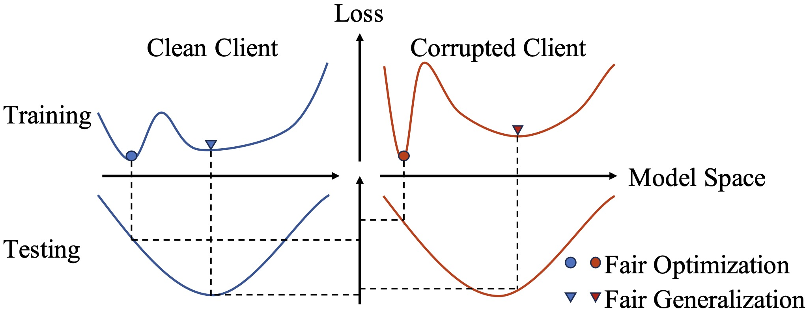

# Fair Federated Learning for Medical Image Analysis

Welcome to the official repository for the papers titled:  
- [From Optimization to Generalization: Fair Federated Learning against Quality Shift via Inter-Client Sharpness Matching](https://arxiv.org/abs/2404.17805)  
- [Fair Federated Medical Image Classification Against Quality Shift via Inter-Client Progressive State Matching](https://arxiv.org/abs/2503.09587) (under review)

The first paper has been accepted for presentation in the main technical track of `IJCAI'24`. The second paper is an extended version of the first one.

<p align="center">
    
</p>


## Updates  
- **`Jan. 12, 2025`:** We have introduced an extended method, i.e., **FedISM+**.


## About
In this repository, we provide the implementation of our proposed **FedISM** and **FedISM+** approaches, along with **other baseline methods** including [FedAvg (AISTATS'17)](https://arxiv.org/abs/1602.05629), [Agnostic-FL (ICML'19)](https://arxiv.org/abs/1902.00146), [q-FedAvg (ICLR'20)](https://arxiv.org/abs/1905.10497), [FairFed (AAAI'23)](https://arxiv.org/abs/2110.00857), [FedCE (CVPR'23)](https://arxiv.org/abs/2303.16520) and [FedGA (CVPR'23)](https://openaccess.thecvf.com/content/CVPR2023/papers/Zhang_Federated_Domain_Generalization_With_Generalization_Adjustment_CVPR_2023_paper.pdf).

Our goal is to advance the development of fair federated learning in medical image analysis and related fields.


## Requirements
We recommend using conda to setup the environment. See `code/requirements.txt` for the environment configuration.


## Datasets Preparation
Please download the ICH dataset from [kaggle](https://www.kaggle.com/c/rsna-intracranial-hemorrhage-detection). Please download the ISIC 2019 dataset from this [link](https://challenge.isic-archive.com/data/#2019). 

Training-testing partition can be found in the `/data`.

Take ICH for example, you should put images into `/data/ICH_20/train/clean` and `/data/ICH_20/test/clean`. After it, generate corrupted images with `/data/ICH_20/add_noise.ipynb`. You may finally get directories, like the following example. 

```
└── data
    ├── ICH_20
    │   │
    │   ├── test
    │   │   ├── clean
    │   │   ├── gaussian_1
    │   │   ├── gaussian_2
    │   │   ├── gaussian_3
    │   │   ├── gaussian_4
    │   │   └── gaussian_5
    │   │
    │   └── train
    │       ├── clean
    │       └── gaussian3_16_4_dir1.0
    │
    └── ISIC2019_20
```

## Run
If everything is ready, you may try:

```
python code/train_Baseline.py --dataset ICH_20 --noise 1 --alg FedISM --corrupted_num 4 --q 2.0 --beta 0.5
```
You may also run other baseline methods, like:
```
python code/train_Baseline.py --dataset ICH_20 --noise 1 --alg q_FedAvg --corrupted_num 4 --q 1.0
```


## Citation
If this repository is useful for your research, please consider citing:
```
@inproceedings{FedISM,
    title={From Optimization to Generalization: Fair Federated Learning against Quality Shift via Inter-Client Sharpness Matching},
    author={Wu, Nannan and Kuang, Zhuo and Yan, Zengqiang and Yu, Li},
    booktitle={IJCAI},
    year={2024}
}
```

## Contact
If you have any questions, please contact wnn2000@hust.edu.cn.
